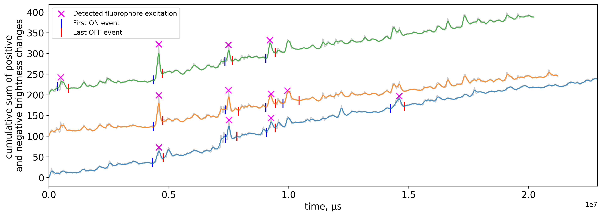
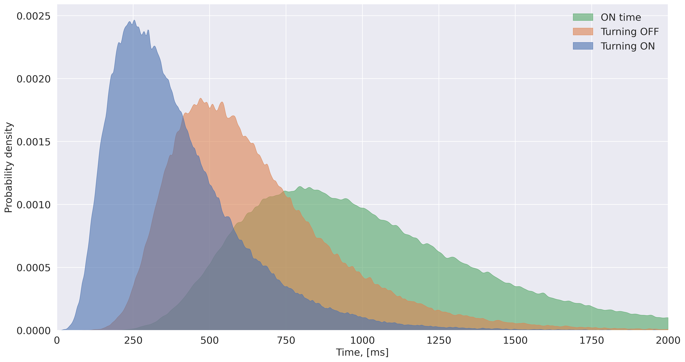
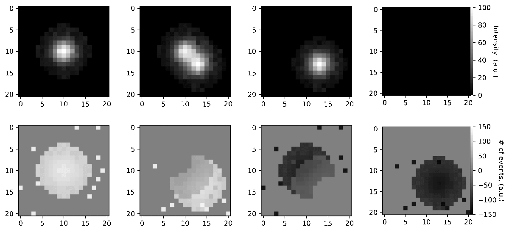

# PeakLoc
A framework for Single Molecule Localization Microscopy using an event-based camera.

## Installation
Clone the repository and create a conda environment with the dependencies.

`git clone https://github.com/androbaza/PeakLoc.git`

`conda env create -f environment.yml -n peakloc`

## Usage

PeakLoc.py is the main script. Input the path to the data. The script will create a folder with the same name as the file and save the localizations there. 

128Gb of RAM is recommended. For a full-schip (1280x720) recording of 600 seconds, the script will take about 10 minutes to run on a 24-core machine.

## Results

The blinks are detected from each pixel's graph from the cumulative sum of events. Theoretically, the methods extracts all blinks from the recording, not affected by psf overlaps and the blinking duration. It precisely identifies the 'Turning_ON' and 'Turning_OFF' timestamps as well, based on a spline interpolation of the signal. 

This extracts the statistics about each individual fluorophore at the given location and the global sample photophysical statistics as well.

A simulation for a simple point spread function overlap is shown below. The simulated event camera response is shown on the bottom row. This should allow for denser labeling acquisition using the event camera.

