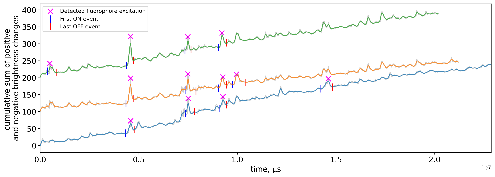
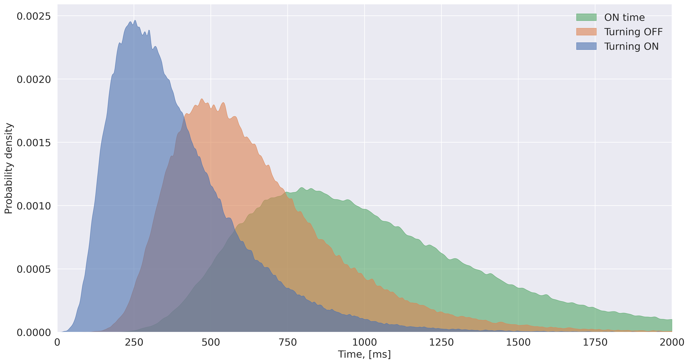
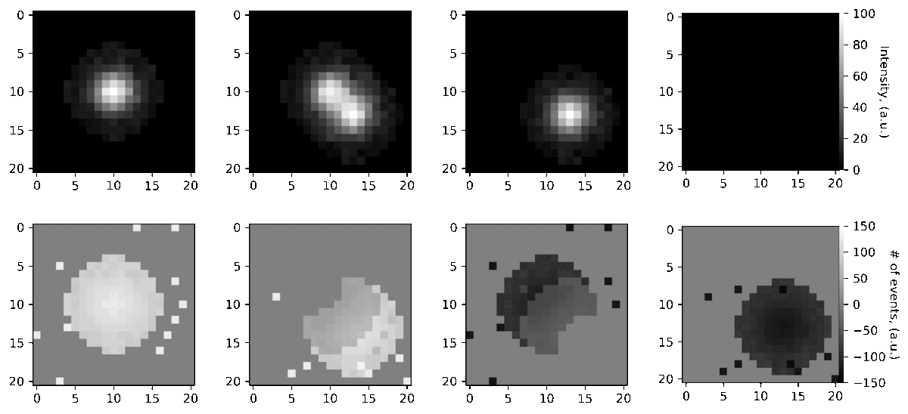

# PeakLoc
A framework for Single Molecule Localization Microscopy using an event-based camera.

## Installation
Clone the repository and install the pixi environment.

`git clone https://github.com/androbaza/PeakLoc.git`

`pixi install`

PeakLoc uses the Ubuntu `metavision-openeb` Python bindings for RAW file reading. On
Ubuntu 24 these are expected under `/usr/lib/python3/dist-packages`; Installation steps: [docs.prophesee.ai](https://docs.prophesee.ai/stable/installation/linux_openeb_with_packages.html)

`pixi.toml`
bridges that path into the pixi Python 3.12 environment.

## Usage

PeakLoc.py is the main script. Run it through pixi:

`pixi run peakloc`

By default, `PeakLoc.py` reads settings from `config.json` at the repository root.
The checked-in config points to `data/` for local smoke runs and records the
effective settings in each output folder's `reports/` subfolder. To process
another directory, edit `input_folder` in `config.json` or pass a separate config:

`pixi run python PeakLoc.py --config /path/to/config.json`

Environment overrides are still available for quick runs:

`PEAKLOC_INPUT_FOLDER=/path/to/raw/files pixi run peakloc`

The script creates a folder with the same name as each input file and saves the
localizations there. Configure `slice_start` and `slice_duration` in `config.json`
or set `PEAKLOC_SLICE_START` and `PEAKLOC_SLICE_DURATION` to adjust time slicing.
Helper scripts are in `scripts/`, with pixi tasks such as `pixi run import-test`
and `pixi run peaks-dict-to-locs`. To render an existing localization file as an
SMLM image, run:

`pixi run plot-result /path/to/localizations.npy`

If no path is provided, the plotting script prompts for one.

128Gb of RAM is recommended. For a full-schip (1280x720) recording of 600 seconds, the script will take about 10 minutes to run on a 24-core machine.

## Results

The blinks are detected from each pixel's graph from the cumulative sum of events. Theoretically, the method extracts all blinks from the recording, not affected by psf overlaps and the blinking duration. It precisely identifies the 'Turning_ON' and 'Turning_OFF' timestamps as well, based on a spline interpolation of the signal. 

This extracts the statistics about each individual fluorophore at the given location and the global sample photophysical statistics as well.

A simulation for a simple point spread function overlap is shown below. The simulated event camera response is shown on the bottom row. This should allow for denser labeling acquisition using the event camera.

## Output Files

For every processed recording, PeakLoc creates an output folder next to the input
file. For example, `data/AF647_coverslip.raw` produces `data/AF647_coverslip/`.

The main result file is
`localizations_prominence_fwhm_<fwhm>_prominence_<prominence>.npy`. It is a
structured NumPy array with one fitted event-localization row per blink. The main
coordinate fields are `x` and `y` in camera pixels. If `double == 1`, the
secondary fitted component is stored in `x2` and `y2`. Convert coordinates to nm
with `config.json` field `optical_pixel_size_nm` (67 nm by default). Other useful
fields include `t_peak`, `t_1st`, `t_last`, `I`, `FWHM`, `rms`, `E_total`, and the
corresponding negative-polarity fit fields ending in `_n`.

The ROI file,
`rois_prominence_fwhm_<fwhm>_prominence_<prominence>.npy`, stores the fitted ROI
event-count images and timing maps used to produce the localization table. It is
mainly useful for quality control, re-fitting experiments, and debugging fitting
or ROI-generation changes.

The `figures/` subfolder contains diagnostic ROI-fit images and, when
`plot_result` is `true`, SMLM result renders:

- `*_smlm_<datetime>.png`: 8-bit annotated preview with a scalebar.
- `*_smlm_<datetime>_12bit.tiff`: 12-bit grayscale render without annotations,
  suitable for downstream image analysis.

The `reports/` subfolder stores the effective settings JSON and a Markdown run
report with processed slice counts, localization counts, timings, and artifact
paths.

Common downstream processing starts from the localization `.npy`: filter by
`rms`, `FWHM`, `E_total`, and time fields; convert `x`/`y` to nm; apply drift
correction if needed; render density images; estimate resolution with FRC; or
load the coordinate table as points in tools such as Napari.
